# TweenEasing

イージングを表現するJavaライブラリ

参考: jQuery Easing Plugin: <http://gsgd.co.uk/sandbox/jquery/easing/>

|name|IN|OUT|IN-OUT|
|---|---|---|---|
|LINEAR|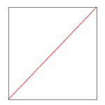|||
|QUAD|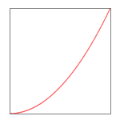|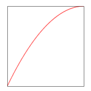|
|CUBIC|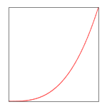|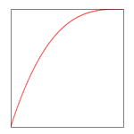|
|QUART|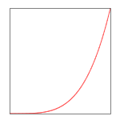|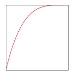|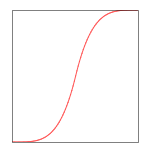
|QUINT|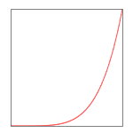|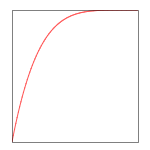|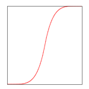
|SINE|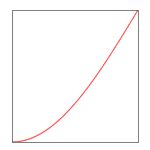|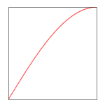|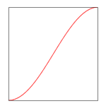
|EXPO|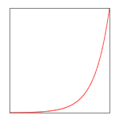|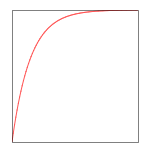|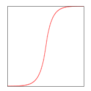
|CIRC|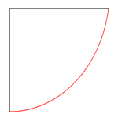|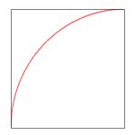|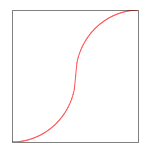
|ELASTIC|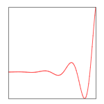|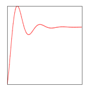|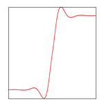
|BACK|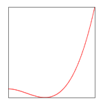|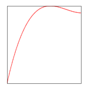|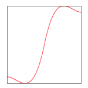
|BOUNCE|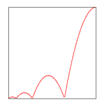|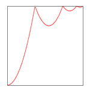|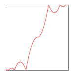


## Javaバージョン

* Java Platform version 8以上


## ビルド

ビルドツールに Gradleを使っている。Gradlewを使うことで、JDKが入った環境であればビルドできる。
以下のコマンドを実行すると、Jarでパッケージングされて `/build/libs/MessageData-{version}.jar` に配置される。

```
./gradlew build
```


## フォーマット

以下のコマンドを実行すると、ソースコードがフォーマットさせる。
```
./gradlew spotlessApply
```


## テスト

以下のコマンドを実行すると、テストが実行される。`/build/reports/tests/index.html` をブラウザで開くと見られる。

```
./gradlew test
```


## ドキュメント

以下のコマンドを実行すると、Javadocが作成される。`/build/docs/javadoc/index.html` をブラウザで開くと見られる。

```
./gradlew javadoc
```


## 依存ライブラリ

Gradleで依存ライブラリを管理している。
`build.gradle` の `dependencies` に必要なライブラリを列挙する。

```
dependencies {
    compile 'org.slf4j:slf4j-api:1.7.25'

    // JUnit
    testCompile 'junit:junit:4.12'
}
```


## メンテナー

* 平田良太 <hirata@team-lab.com>

