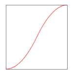

# TweenEasing

イージングを表現するJavaライブラリ

参考: jQuery Easing Plugin: <http://gsgd.co.uk/sandbox/jquery/easing/>

|name|IN|OUT|IN-OUT|
|---|---|---|---|
|LINEAR|||[](./src/main/java/jp/harujioh/easing/LinearEasing.java)|
|QUAD|[](./src/main/java/jp/harujioh/easing/in/InQuadEasing.java)|[](./src/main/java/jp/harujioh/easing/out/OutQuadEasing.java)|[](./src/main/java/jp/harujioh/easing/inout/InOutQuadEasing.java)|
|CUBIC|[](./src/main/java/jp/harujioh/easing/in/InCubicEasing.java)|[](./src/main/java/jp/harujioh/easing/out/OutCubicEasing.java)|[](./src/main/java/jp/harujioh/easing/inout/InOutCubicEasing.java)|
|QUART|[](./src/main/java/jp/harujioh/easing/in/InQuartEasing.java)|[](./src/main/java/jp/harujioh/easing/out/OutQuartEasing.java)|[](./src/main/java/jp/harujioh/easing/inout/InOutQuartEasing.java)|
|QUINT|[](./src/main/java/jp/harujioh/easing/in/InQuintEasing.java)|[](./src/main/java/jp/harujioh/easing/out/OutQuintEasing.java)|[](./src/main/java/jp/harujioh/easing/inout/InOutQuintEasing.java)|
|SINE|[](./src/main/java/jp/harujioh/easing/in/InSineEasing.java)|[](./src/main/java/jp/harujioh/easing/out/OutSineEasing.java)|[](./src/main/java/jp/harujioh/easing/inout/InOutSineEasing.java)|
|EXPO|[](./src/main/java/jp/harujioh/easing/in/InExpoEasing.java)|[](./src/main/java/jp/harujioh/easing/out/OutExpoEasing.java)|[](./src/main/java/jp/harujioh/easing/inout/InOutExpoEasing.java)|
|CIRC|[](./src/main/java/jp/harujioh/easing/in/InCircEasing.java)|[](./src/main/java/jp/harujioh/easing/out/OutCircEasing.java)|[](./src/main/java/jp/harujioh/easing/inout/InOutCircEasing.java)|
|ELASTIC|[](./src/main/java/jp/harujioh/easing/in/InElasticEasing.java)|[](./src/main/java/jp/harujioh/easing/out/OutElasticEasing.java)|[](./src/main/java/jp/harujioh/easing/inout/InOutElasticEasing.java)|
|BACK|[](./src/main/java/jp/harujioh/easing/in/InBackEasing.java)|[](./src/main/java/jp/harujioh/easing/out/OutBackEasing.java)|[](./src/main/java/jp/harujioh/easing/inout/InOutBackEasing.java)|
|BOUNCE|[](./src/main/java/jp/harujioh/easing/in/InBounceEasing.java)|[](./src/main/java/jp/harujioh/easing/out/OutBounceEasing.java)|[](./src/main/java/jp/harujioh/easing/inout/InOutBounceEasing.java)|


## Javaバージョン

* Java Platform version 8以上


## ビルド

ビルドツールに Gradleを使っている。Gradlewを使うことで、JDKが入った環境であればビルドできる。
以下のコマンドを実行すると、Jarでパッケージングされて `/build/libs/MessageData-{version}.jar` に配置される。

```
./gradlew build
```


## フォーマット

以下のコマンドを実行すると、ソースコードがフォーマットさせる。
```
./gradlew spotlessApply
```


## テスト

以下のコマンドを実行すると、テストが実行される。`/build/reports/tests/index.html` をブラウザで開くと見られる。

```
./gradlew test
```


## ドキュメント

以下のコマンドを実行すると、Javadocが作成される。`/build/docs/javadoc/index.html` をブラウザで開くと見られる。

```
./gradlew javadoc
```


## 依存ライブラリ

Gradleで依存ライブラリを管理している。
`build.gradle` の `dependencies` に必要なライブラリを列挙する。

```
dependencies {
    compile 'org.slf4j:slf4j-api:1.7.25'

    // Image
    imageCompile 'org.jfree:jfreechart:1.0.19'
}
```


## メンテナー

* 平田良太 <hirata@team-lab.com>

